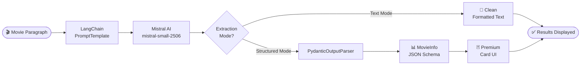

<div align="center">

<!-- HERO BANNER -->


<br/>

<!-- BADGES ROW 1 -->

&nbsp;

&nbsp;

&nbsp;

&nbsp;


<br/><br/>

<!-- BADGES ROW 2 -->

&nbsp;

&nbsp;

&nbsp;


<br/><br/>

<!-- CTA BUTTONS -->
<a href="https://huggingface.co/spaces/Anmoldhiman17/moviemind-ai">
  
</a>
&nbsp;&nbsp;
<a href="https://github.com/anmoldhiman17/moviemind-ai-intelligence">
  
</a>
&nbsp;&nbsp;
<a href="https://github.com/anmoldhiman17/moviemind-ai-intelligence/blob/main/app.py">
  
</a>

<br/><br/>

> ### *"Not just another AI wrapper — a full intelligence pipeline for cinematic data extraction."*

</div>

---

<br/>

<div align="center">

</div>

<br/>

---

## 🎥 Visual Demo

<div align="center">

> *See CineMind AI in action — paste any movie description and watch the AI extract structured intelligence in real-time.*

<br/>

| 🏠 Welcome Screen | 🤖 AI Extraction |
|:-:|:-:|
|  |  |

<br/>

| 🎭 Structured Mode Cards | 😶 Empty / Error State |
|:-:|:-:|
|  |  |

<br/>


</div>

<br/>

---

## ✨ Features

<br/>

<div align="center">

```
┌─────────────────────────────────────────────────────────────┐
│                    WHAT CINEMIND DOES                       │
│  ─────────────────────────────────────────────────────────  │
│   Input: Any movie paragraph, synopsis, review, trivia      │
│   Output: Structured intelligence in 2 powerful modes       │
└─────────────────────────────────────────────────────────────┘
```

</div>

<br/>

<table align="center" width="90%">
<tr>
<td width="50%" valign="top">

### 🔍 Dual Extraction Engine
**Two powerful modes in one app:**

🧾 **Text Mode** — Prompt-based extraction using a precision-crafted system prompt. Returns clean, human-readable structured fields with NULL-safe defaults.

🧠 **Structured Mode** — Pydantic schema + LangChain parser. Returns fully typed JSON output rendered as premium interactive cards.

</td>
<td width="50%" valign="top">

### 🧠 Mistral AI Core
**Model:** `mistral-small-2506`

The extraction backbone. Fast, accurate, cost-efficient. Handles ambiguous movie descriptions, missing fields, and multi-language inputs with grace.

Zero hallucination policy — unknown fields return `NULL`, not guesses.

</td>
</tr>
<tr>
<td width="50%" valign="top">

### ⚡ LangChain Pipeline
**Full production pipeline:**
- `ChatPromptTemplate` — structured prompt engineering
- `ChatMistralAI` — model binding
- `PydanticOutputParser` — typed output parsing
- Message-based conversation flow
- Chainable, composable, extensible

</td>
<td width="50%" valign="top">

### 📊 Structured Pydantic Output
**MovieInfo schema includes:**
- `title`, `release_year`, `genre[]`
- `director`, `main_cast[]`
- `setting_location`, `plot`
- `themes[]`, `ratings`
- `notable_features`, `short_summary`

</td>
</tr>
<tr>
<td width="50%" valign="top">

### 🎨 2026-Level Futuristic UI
- Glassmorphism panels with blur + transparency
- Neon purple/cyan gradient system
- Animated background with `hue-rotate` pulse
- Staggered card animations
- Hover lift effects + glow borders
- `Syne` display font + `DM Sans` body

</td>
<td width="50%" valign="top">

### ⚡ Performance & UX
- `@st.cache_resource` model caching
- One-click sample input (Inception demo)
- JSON raw output toggle
- Copy-friendly code block
- Error UI with graceful fallback
- Mobile-responsive layout

</td>
</tr>
</table>

<br/>

---

## 🧩 How It Works

<br/>

<div align="center">



</div>

<br/>

<div align="center">
<table width="80%">
<tr>
<td align="center" width="20%"><b>Step 1</b></td>
<td align="center" width="20%"><b>Step 2</b></td>
<td align="center" width="20%"><b>Step 3</b></td>
<td align="center" width="20%"><b>Step 4</b></td>
<td align="center" width="20%"><b>Step 5</b></td>
</tr>
<tr>
<td align="center">📝<br/>Paste movie paragraph into the input area</td>
<td align="center">⚙️<br/>LangChain formats it via ChatPromptTemplate</td>
<td align="center">🤖<br/>Mistral AI processes and extracts fields</td>
<td align="center">🔄<br/>Output parsed — text or Pydantic schema</td>
<td align="center">🎴<br/>Results rendered as cards or formatted text</td>
</tr>
</table>
</div>

<br/>

---

## 🏗️ Tech Stack

<br/>

<div align="center">

| Layer | Technology | Purpose |
|:-----:|:----------:|:-------:|
| 🖥️ **Frontend** |  | UI framework + custom CSS |
| 🧠 **AI Model** |  | `mistral-small-2506` LLM |
| ⛓️ **Orchestration** |  | Prompt + chain management |
| 📐 **Schema** |  | Structured output parsing |
| 🐍 **Runtime** |  | Core language |
| ☁️ **Deployment** |  | Cloud hosting |

</div>

<br/>

---

## ⚙️ Installation

<br/>

**1. Clone the repository**

```bash
git clone https://github.com/anmoldhiman17/moviemind-ai-intelligence.git
cd moviemind-ai-intelligence
```

**2. Install dependencies**

```bash
pip install -r requirements.txt
```

**3. Set up environment variables**

```bash
# Create .env file
touch .env
```

```env
# .env
MISTRAL_API_KEY=your_mistral_api_key_here
```

> 🔑 Get your free Mistral API key at [console.mistral.ai](https://console.mistral.ai)

**4. Run the app**

```bash
streamlit run app.py
```

**5. Open in browser**

```
http://localhost:8501
```

<br/>

---

## ▶️ Usage

<br/>

```
1.  Open the app in your browser
2.  Select extraction mode from the sidebar:
       🧾 Text Mode    →  Clean readable output
       🧠 Structured   →  Cards + JSON schema
3.  Paste any movie description, synopsis, or trivia
4.  Click  🚀 Extract Intelligence
5.  View extracted fields instantly
6.  Toggle JSON output (Structured Mode)
7.  Use  💡 Load Sample  to test with Inception
8.  Use  🗑 Clear  to reset and start fresh
```

<br/>

**Example Input:**
```text
Inception (2010) is a mind-bending science fiction thriller directed by Christopher Nolan.
The film stars Leonardo DiCaprio as Dom Cobb, a skilled thief who specializes in the art
of extraction — stealing valuable secrets from deep within the subconscious mind during
the dream state...
```

**Example Output (Text Mode):**
```
Movie Title:      Inception
Release Year:     2010
Genre:            Science Fiction, Thriller
Director:         Christopher Nolan
Main Cast:        Leonardo DiCaprio, Joseph Gordon-Levitt, Elliot Page, Tom Hardy
Setting/Location: Multiple dream levels — Paris, snowy fortress, zero-gravity hotel
Ratings:          IMDb 8.8/10
...
Short Summary:    A thief who steals secrets through dreams is given a chance to have
                  his past erased if he can plant an idea in a target's subconscious.
```

<br/>

---

## 📁 Project Structure

<br/>

```
moviemind-ai-intelligence/
│
├── 📄 app.py                  # Main Streamlit application
├── 📋 requirements.txt        # Python dependencies
├── 🐳 Dockerfile              # HuggingFace deployment config
├── 📖 README.md               # You are here
├── 🔐 .env                    # API keys (not committed)
│
├── 📸 assets/
│   ├── welcome.png            # Welcome screen screenshot
│   ├── chat.png               # Extraction demo screenshot
│   ├── robot.png              # Structured mode screenshot
│   └── sad.png                # Empty/error state screenshot
│
└── 📝 .gitignore              # Ignores .env, __pycache__, etc.
```

<br/>

---

## 💎 Why CineMind Is Different

<br/>

<div align="center">

```
┌───────────────────────────────────────────────────────────────────┐
│                    NOT JUST ANOTHER AI APP                        │
└───────────────────────────────────────────────────────────────────┘
```

</div>

<br/>

<table align="center" width="85%">
<tr>
<td>🔬</td>
<td><b>Real AI Pipeline</b></td>
<td>Not a simple API call — a full LangChain pipeline with structured prompt engineering, model binding, and typed output parsing.</td>
</tr>
<tr>
<td>🔀</td>
<td><b>Dual Extraction System</b></td>
<td>Two distinct extraction architectures in one app: prompt-based readable output AND Pydantic schema-validated JSON — pick what your downstream needs.</td>
</tr>
<tr>
<td>🛡️</td>
<td><b>NULL-Safe Design</b></td>
<td>Fields not present in the input return <code>NULL</code> — never hallucinated values. Trust the output.</td>
</tr>
<tr>
<td>🎨</td>
<td><b>Portfolio-Ready SaaS UI</b></td>
<td>Glassmorphism, neon gradients, animated backgrounds, staggered card transitions — built to impress, not just function.</td>
</tr>
<tr>
<td>☁️</td>
<td><b>Production Deployed</b></td>
<td>Live on HuggingFace Spaces with Docker. Real deployment, real infrastructure — not just a local demo.</td>
</tr>
<tr>
<td>🧩</td>
<td><b>Extensible Architecture</b></td>
<td>The pipeline is modular — swap Mistral for GPT-4 or Gemini, extend the Pydantic schema, add new output modes in minutes.</td>
</tr>
</table>

<br/>

---

## 🤝 Contributing

<br/>

Contributions are welcome! Here's how:

```bash
# 1. Fork the repo
# 2. Create your feature branch
git checkout -b feature/AmazingFeature

# 3. Commit your changes
git commit -m 'Add AmazingFeature'

# 4. Push to branch
git push origin feature/AmazingFeature

# 5. Open a Pull Request
```

<br/>

**Ideas for contributions:**
- 🌐 Add support for other LLM providers (OpenAI, Gemini, Cohere)
- 📊 Add a movie comparison feature
- 🗂️ Export results to CSV / PDF
- 🌍 Multi-language support
- 🧪 Add unit tests for extraction pipeline

<br/>

---

## 📜 License

<br/>

<div align="center">

Distributed under the **MIT License**.

```
MIT License — free to use, modify, and distribute.
Attribution appreciated but not required.
```

See [`LICENSE`](LICENSE) for full details.

</div>

<br/>

---

## 👨‍💻 Author

<br/>

<div align="center">


**Anmol Dhiman**

[](https://github.com/anmoldhiman17)
&nbsp;
[](https://huggingface.co/Anmoldhiman17)

<br/>

*Building AI products that look as good as they work.*

</div>

<br/>

---

<div align="center">


<br/>

**If this project helped you or impressed you — drop a ⭐**

*It takes 2 seconds and means everything.*

<br/>

[](https://github.com/anmoldhiman17/moviemind-ai-intelligence)

</div>
